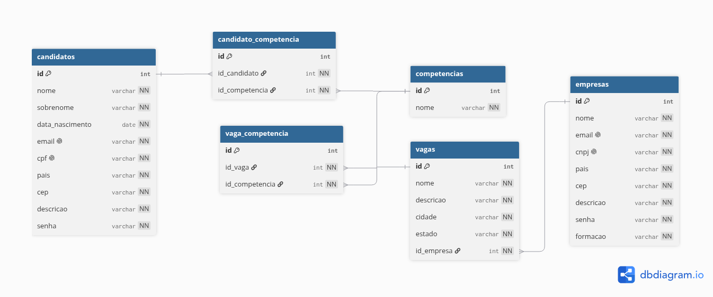

autor: Guilherme Lima Conte

**Como executar:**

# Na raiz do projeto, execute:

`groovy -cp src/main/groovy src/main/groovy/org/example/Main.groovy`

Caso esteja utilizando IntelliJ, é possível executar o projeto apertando o botão de play enquanto está no diretório Main.groovy.

# Informações do projeto:

Optei por explorar o máximo que dava dos benefícios que o groovy proporciona. Para deixar o mais limpo possível não utilizei tipo de visibilidade nas classes, atributos, métodos e construtores e também deixei a maioria dos tipos como def, com exceção das competências que tem como tipo uma lista genérica de strings.
Utilizei do conceito de "Groovy Truth" do curso da udemy no método formatarCompetencias, como listas vazias já possuem valor false me permitiu já iniciar o operador ternário validando a verdade.

É possível adicionar novos candidatos e novas empresas, não foi feito nenhuma validação para confirmar se os tipos estão corretos e no modelo que deve ser seguido no cadastro, mas já é possível.

Devido a diversidade que eu quis deixar nas empresas, não deixei as competências já pré-determinadas para quem vai fazer o cadastro, possibilitando ser qualquer nova competência.

# Front-end

Foi implementando a listagem dos candidatos disponíveis na visão da empresa e as vagas disponíveis na visão do candidato, mostrando todas as informações do candidato/vaga deixando anônimo apenas o nome.
Foi adicionado um cadastro ao lado, da empresa e do candidato.
Por fim da listagem dos candidatos disponíveis há um gráfico em barras adicionado usando a biblioteca chart.js que indica o número de candidatos por competências

# Banco de dados

O banco de dados foi desenvolvido utilizando PostgreSQL, graças a ele pude observar um problema crítico em meu projeto que não considerava Empresa e Vaga como classes diferentes, ccom o desenvolvimento do banco de dados, pude perceber esse erro e corrigi-lo. O arquivo localizado em `database/Linketinder.sql` contém todas as criações, inserções e busca realizadas desde sua criação.
Inicialmente o diagrama entidade relacionamento foi feito no site dbdiagram.io, depois realizei o export em Postgre e continuei no pgadmin4.

Para o Desafio ZG foi implementado a sincronização do Groovy com o banco de dados com a criação das classes dentro do diretório `dao`, foi implementado o CRUD das 4 classes exigidas: Candidato, Empresa, Competencia, Vaga. Além de algumas verificações e buscar a fim de evitar uma possível quebra no banco de dados.

# Match e Curtida

Foi implementado duas novas classes Match e Curtida para que a mecânica de um candidato curtir uma vaga e a empresa responsável por aquela vaga curtir o candidato gere um Match para candidato-vaga. Aproveitei o fato de já ter implementado o banco de dados e criei um novo método em VagaDAO para listar todas as vagas daquela empresa e usar dessa informação durante o menu para quando estivermos sendo a "empresa" aparecer todas as vagas que aquela empresa possui.

